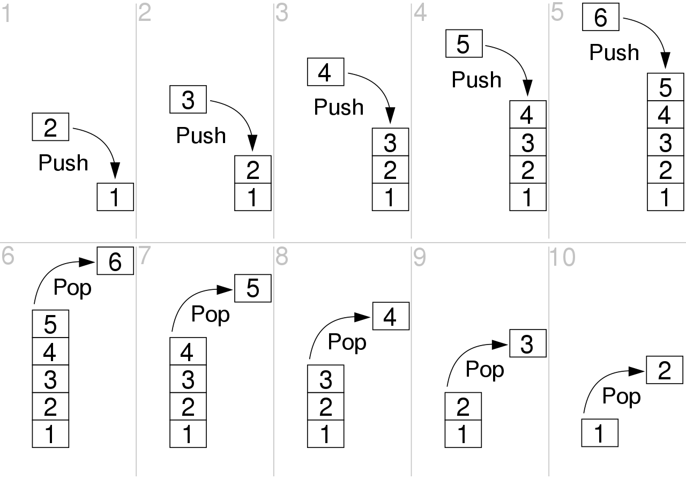

## Структуры данных

**Переменная** — поименованная, либо адресуемая иным способом область памяти, которая используется для хранения данных.
Хранимое значение можно получать (копировать) и изменять в ходе выполнения программы. В Java переменная, кроме имени, всегда имеет тип.

**Массив** — структура данных, хранящая набор однотипных значений (элементов массива), идентифицируемых по номеру (индексу элемента).
Размерность массива — это максимальное количество хранимых элементов. В Java после объявления размерность массива изменить нельзя.
По размерности массивы могут быть одномерные (вектор), двумерные (таблица или матрица), трёхмерные и т.д.

**Стек** (англ. stack — стопка) — структура данных, представляющая собой набор элементов, организованных по принципу LIFO
(англ. last in — first out, «последним пришёл — первым вышел»). Стека сравнивают со стопкой книг: чтобы взять вторую сверху, нужно снять верхнюю.

